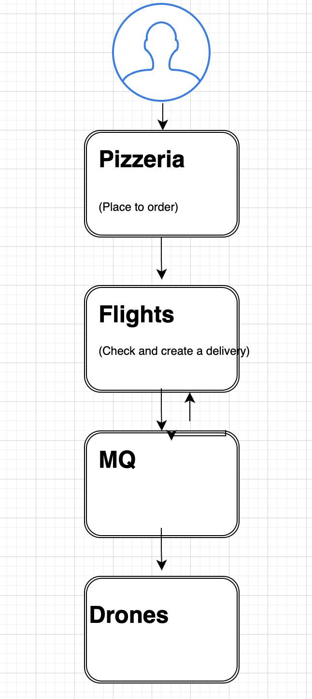
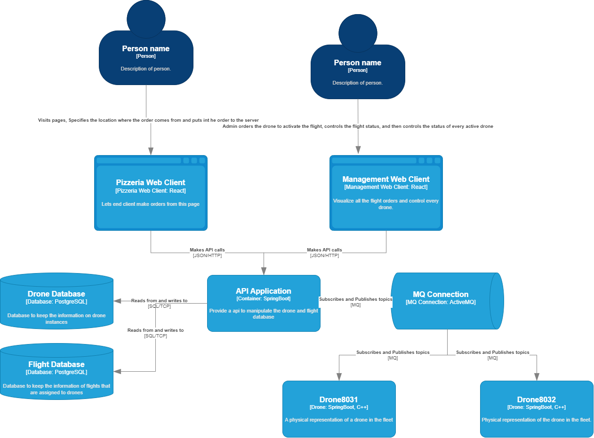
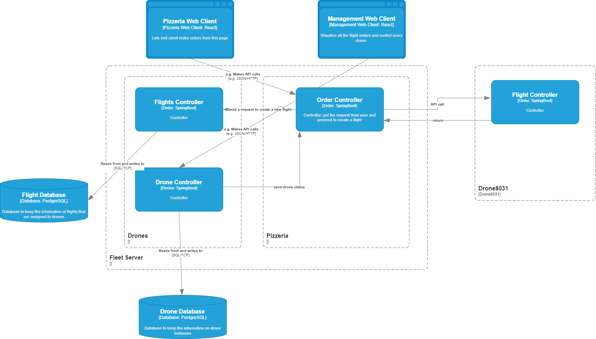
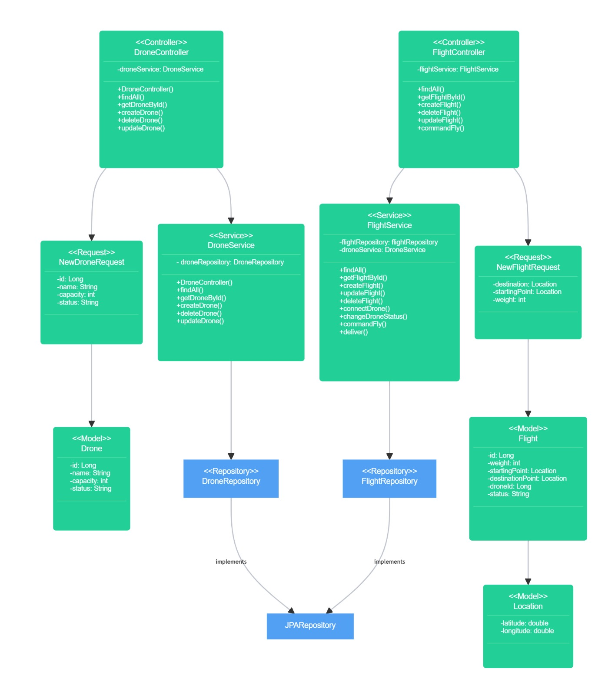
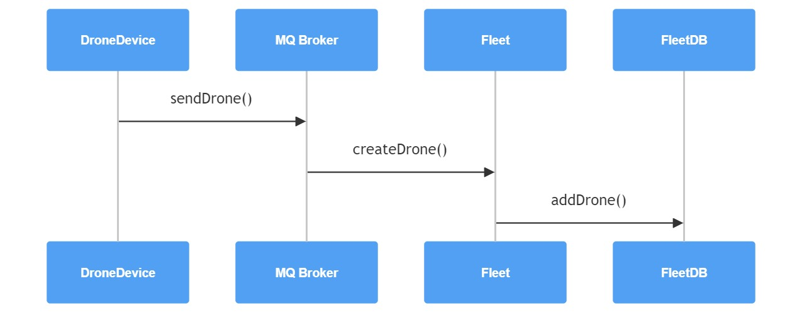
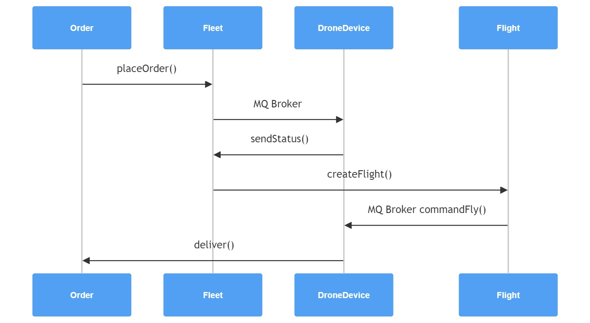
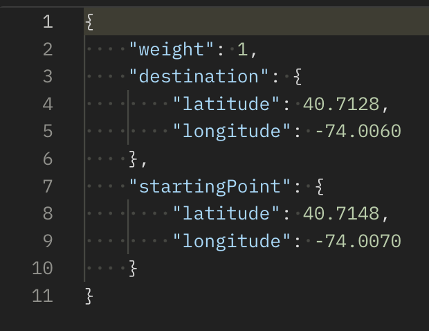

# Drone Transportation Architecture Design and POC

*   [Introduction](#introduction)
*   [Features Implemented and Responsibilities](#features-implemented-and-responsibilities)
*   [Software Architecture Description](#software-architecture-description)
    *   [Context](#context)
    *   [Containers](#containers)
    *   [Component](#component)
    *   [Code](#code)

*   [Operating instructions](#DroneTransportationArchitectureDesignandPOC-Operatinginstructions)
    *   [Installing, setting up, and starting the containers](#installing-setting-up-and-starting-the-containers)
    *   [Testing instructions](#testing-instructions)

## Introduction

This document provides a comprehensive guide to the Drone Fleet Management system. The system is designed to efficiently manage the operations of a drone transportation client, ensuring smooth and timely delivery of food orders. The document includes details on the architecture, implementation, and deployment of the system. It also provides a thorough description of the functionalities of each component and the overall workflow of the system.

The background of the system or software can be traced back to the growing demand for quick and reliable food delivery services in recent years. With the advancements in drone technology, it has become increasingly possible to leverage drones for efficient and accurate food delivery. This system aims to provide a scalable and efficient solution to the problem by integrating advanced drone technologies with robust software infrastructure.

The system was developed as a study project. It was completed as part of Software Architecture and Design during the 2023 Autumn semester.

## Features Implemented and Responsibilities

| **Feature** | **Responsibilities** |
| --- | --- |
| User order pizza | Order food from restaurent’s web app |
| Create a drone flight for delivery | Check the order status, order’s weight… and decide on the drone to be used for delivery |
| Track delivery | User able to track their delivery |

## Software Architecture Description

### Context

### Containers

### Component

### Code

# Operating instructions

## Installing, setting up, and starting the containers

*Hands-on commands with required instructions for starting each container - have a subheading for each system component (container). If there is some prerequisite - like setting up a database server - include instructions for that.*

*Step-by-step instructions for how to*

*   *clone the code for the system:*
    
    *   Clone the code from: [https://gitlab.tamk.cloud/sw-architecture-design-2023-thong-hoang/drones-transportation.git](https://gitlab.tamk.cloud/sw-architecture-design-2023-thong-hoang/drones-transportation.git)
        
*   *compile & run the service*
    
    *   To devices/drone-8031/, run: java -jar drone.jar (Running on port 8031)
        
    *   To devices/drone-8032/, run: java -jar drone.jar (Running on port 8032)
        
    *   To fleet/, run: mvn clean; mvn spring-boot:run (Running on port 8082)
        
    *   To operatingclient, run: npm ci; npm start; (Running on port 3001)
        

## Testing instructions

*Hands-on commands to test the system with example requests. How to verify the result.*

Initial check:

*   Send a GET request to verify you have the drones up and running: [http://localhost:8082/dronora/drones](http://localhost:8082/dronora/drones)
    

Create an order:

*   Send a POST request to [http://localhost:8082/dronepizza/pizzaorders](http://localhost:8082/dronepizza/pizzaorders)
    
*   Content of the body sample:
    
    
*   Please wait for the code to do its magic…
    

How the front end looks: